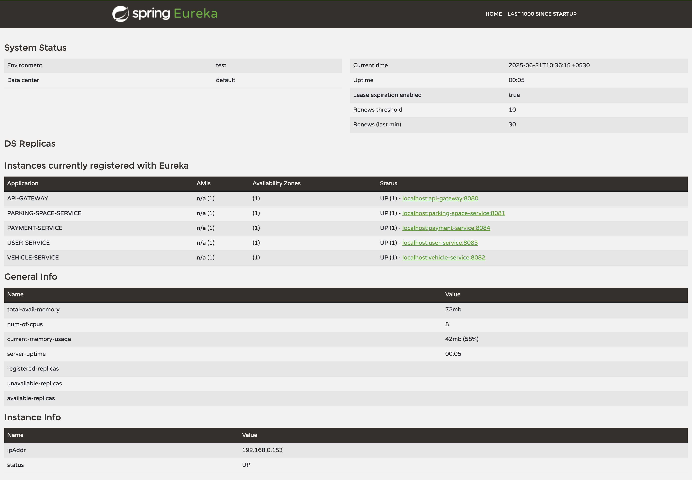

# Smart Parking Management System (SPMS)

A microservice-based smart parking management system built with Spring Boot and Spring Cloud technologies.

## 📋 Table of Contents
- [Overview](#overview)
- [Architecture](#architecture)
- [Technologies Used](#technologies-used)
- [Prerequisites](#prerequisites)
- [Installation & Setup](#installation--setup)
- [Running the Application](#running-the-application)
- [API Documentation](#api-documentation)
- [Database Schema](#database-schema)
- [Testing](#testing)
- [Screenshots](#screenshots)

## 🎯 Overview

The Smart Parking Management System (SPMS) is a cloud-native, microservice-based platform designed to solve urban parking challenges. It provides real-time management and monitoring of parking spaces while allowing users to easily locate, reserve, and pay for parking.

### Key Stakeholders
- **End Users (Drivers)**: Search, reserve, and pay for parking spaces
- **Parking Owners**: Manage and monitor their parking spaces
- **Payment Systems**: Handle secure transactions and digital receipts

### Business Objectives
- ✅ Allow users to search and reserve parking in real time
- ✅ Enable parking owners to monitor and manage their spaces dynamically
- ✅ Track parking space usage per city, zone, and owner
- ✅ Simulate vehicle entry and exit
- ✅ Handle payments securely and generate digital receipts
- ✅ Provide historical logs for users and administrators
- ✅ Reduce traffic congestion and increase parking efficiency

## 🏗️ Architecture

The system follows a microservices architecture with the following components:

```
┌─────────────────┐    ┌─────────────────┐    ┌─────────────────┐
│   API Gateway   │    │  Config Server  │    │  Eureka Server  │
│    (Port 8080)  │    │   (Port 8888)   │    │   (Port 8761)   │
└─────────────────┘    └─────────────────┘    └─────────────────┘
         │                       │                       │
         └───────────────────────┼───────────────────────┘
                                 │
    ┌────────────────────────────┼────────────────────────────┐
    │                            │                            │
┌─────────────────┐    ┌─────────────────┐    ┌─────────────────┐
│ Parking Space   │    │ Vehicle Service │    │  User Service   │
│    Service      │    │   (Port 8082)   │    │   (Port 8083)   │
│   (Port 8081)   │    └─────────────────┘    └─────────────────┘
└─────────────────┘              │                       │
         │                       │                       │
         └───────────────────────┼───────────────────────┘
                                 │
                    ┌─────────────────┐
                    │ Payment Service │
                    │   (Port 8084)   │
                    └─────────────────┘
```

### Microservices

1. **Config Server** (Port 8888)
   - Centralized configuration management
   - Fetches configurations from Git repository

2. **Eureka Server** (Port 8761)
   - Service registry and discovery
   - Health monitoring of microservices

3. **API Gateway** (Port 8080)
   - Single entry point for all client requests
   - Request routing and load balancing

4. **Parking Space Service** (Port 8081)
   - Manages parking space inventory
   - Handles reservations and availability tracking
   - Supports filtering by location, city, zone

5. **Vehicle Service** (Port 8082)
   - Manages vehicle registration and information
   - Simulates vehicle entry/exit tracking
   - Links vehicles to users

6. **User Service** (Port 8083)
   - User registration and authentication
   - Profile management
   - Supports different user types (Regular, Parking Owner, Admin)

7. **Payment Service** (Port 8084)
   - Handles payment transactions
   - Mock payment gateway integration
   - Digital receipt generation

## 🛠️ Technologies Used

| Technology | Purpose |
|------------|---------|
| **Spring Boot 3.2.0** | Core framework for microservices |
| **Spring Cloud 2023.0.0** | Microservices infrastructure |
| **Spring Cloud Eureka** | Service registry and discovery |
| **Spring Cloud Config** | Centralized configuration management |
| **Spring Cloud Gateway** | API Gateway and routing |
| **Spring Data JPA** | Data persistence layer |
| **Spring Security** | Authentication and authorization |
| **MySQL 8.0** | Database management system |
| **Maven** | Build and dependency management |
| **Java 17** | Programming language |

## 📋 Prerequisites

Before running the application, ensure you have the following installed:

- **Java 17** or higher
- **Maven 3.6+**
- **MySQL 8.0+**
- **Git**
- **Postman** (for API testing)

## 🚀 Installation & Setup

### 1. Clone the Repository

```bash
git clone https://github.com/your-username/Smart-Parking-Management-System.git
cd Smart-Parking-Management-System
```

### 2. Database Setup

Create MySQL databases for each service:

```sql
CREATE DATABASE spms_parking_space_db;
CREATE DATABASE spms_vehicle_db;
CREATE DATABASE spms_user_db;
CREATE DATABASE spms_payment_db;
```

### 3. Cloud Configuration Setup

The application uses Spring Cloud Config with the following Git repository:
```
https://github.com/DilsaraThiranjaya/SPMS-cloud-config.git
```

Ensure the configuration repository contains the required YAML files for each service.

### 4. Build the Project

```bash
mvn clean install
```

## 🏃‍♂️ Running the Application

Start the services in the following order:

### 1. Start Config Server
```bash
cd config-server
mvn spring-boot:run
```
Wait for the service to start completely before proceeding.

### 2. Start Eureka Server
```bash
cd eureka-server
mvn spring-boot:run
```
Access Eureka Dashboard at: http://localhost:8761

### 3. Start API Gateway
```bash
cd api-gateway
mvn spring-boot:run
```

### 4. Start Microservices (in any order)

**Parking Space Service:**
```bash
cd parking-space-service
mvn spring-boot:run
```

**Vehicle Service:**
```bash
cd vehicle-service
mvn spring-boot:run
```

**User Service:**
```bash
cd user-service
mvn spring-boot:run
```

**Payment Service:**
```bash
cd payment-service
mvn spring-boot:run
```

## 📚 API Documentation

### Base URLs
- **API Gateway**: http://localhost:8080
- **Direct Service Access** (for development):
  - Parking Space Service: http://localhost:8081
  - Vehicle Service: http://localhost:8082
  - User Service: http://localhost:8083
  - Payment Service: http://localhost:8084

### Key API Endpoints

#### User Service
```
POST /api/users/register          # Register new user
POST /api/users/authenticate      # User authentication
GET  /api/users                   # Get all users
GET  /api/users/{id}              # Get user by ID
PUT  /api/users/{id}              # Update user
```

#### Parking Space Service
```
GET  /api/parking-spaces          # Get all parking spaces
GET  /api/parking-spaces/available # Get available spaces
POST /api/parking-spaces          # Create parking space
PUT  /api/parking-spaces/{id}/reserve # Reserve parking space
PUT  /api/parking-spaces/{id}/release # Release parking space
```

#### Vehicle Service
```
GET  /api/vehicles                # Get all vehicles
POST /api/vehicles                # Register vehicle
PUT  /api/vehicles/{id}/entry     # Simulate vehicle entry
PUT  /api/vehicles/{id}/exit      # Simulate vehicle exit
```

#### Payment Service
```
GET  /api/payments                # Get all payments
POST /api/payments                # Create payment
POST /api/payments/{id}/process   # Process payment
PUT  /api/payments/{id}/refund    # Refund payment
```

## 🗄️ Database Schema

Each microservice has its own database:

### User Service Database (spms_user_db)
- **users**: User information and authentication

### Parking Space Service Database (spms_parking_space_db)
- **parking_spaces**: Parking space inventory and status

### Vehicle Service Database (spms_vehicle_db)
- **vehicles**: Vehicle registration and tracking

### Payment Service Database (spms_payment_db)
- **payments**: Payment transactions and history

## 🧪 Testing

### Postman Collection
Import the Postman collection for comprehensive API testing:

[Postman Collection](./postman_collection.json)

### Manual Testing Steps

1. **Register a User**
   ```bash
   POST http://localhost:8080/api/users/register
   ```

2. **Create Parking Spaces**
   ```bash
   POST http://localhost:8080/api/parking-spaces
   ```

3. **Register Vehicles**
   ```bash
   POST http://localhost:8080/api/vehicles
   ```

4. **Reserve Parking Space**
   ```bash
   PUT http://localhost:8080/api/parking-spaces/{id}/reserve
   ```

5. **Process Payment**
   ```bash
   POST http://localhost:8080/api/payments/{id}/process
   ```

## 📸 Screenshots

### Eureka Dashboard


The Eureka dashboard shows all registered microservices and their health status.

## 👥 Author

- **Dilsara Thiranjaya**

---